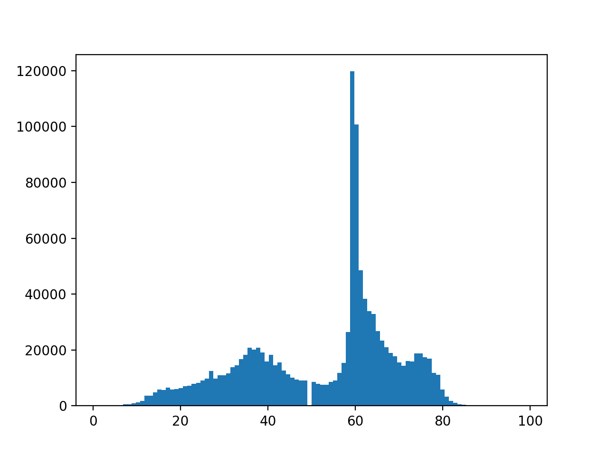
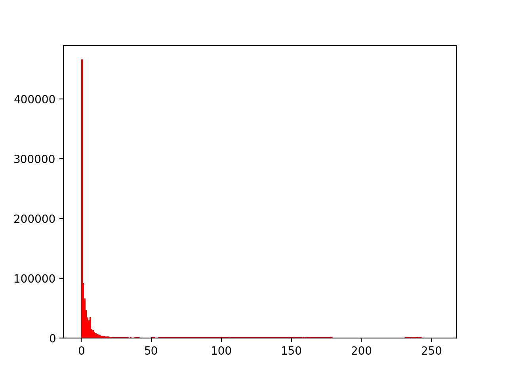
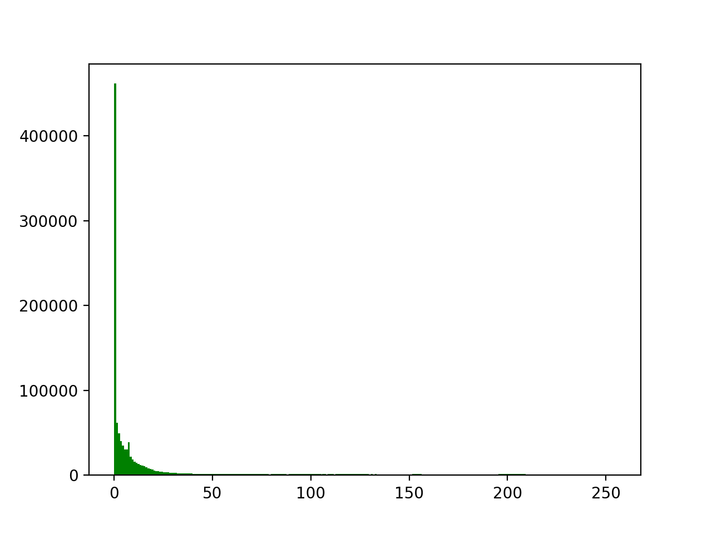
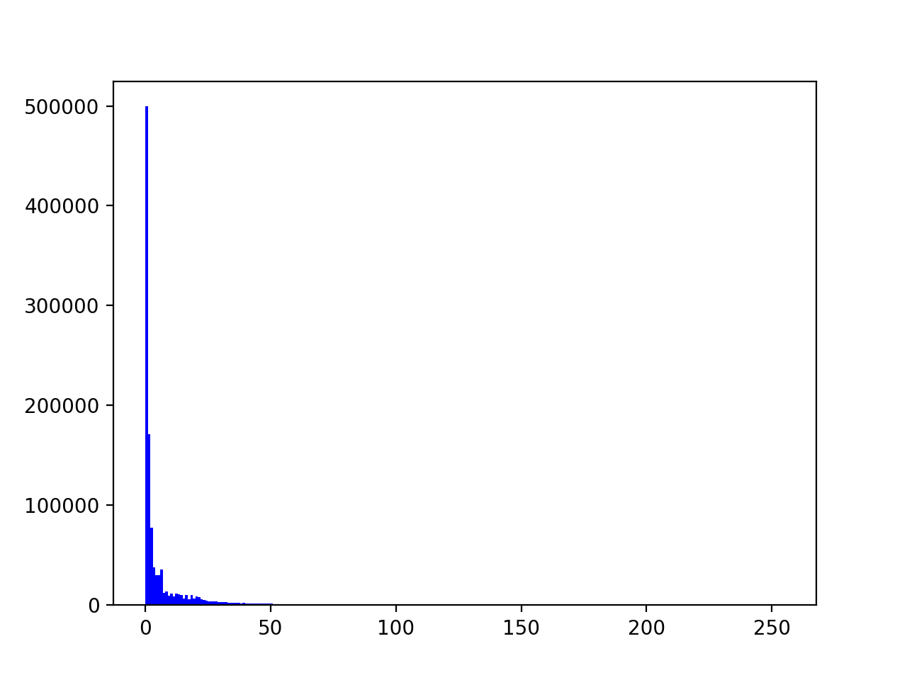

# Colors_convert

# Install dependencies:
```
pip3 install -U -r requirements.txt
```
# How to run
```
python main.py
```
# Histograms

## Grayscale histogram.


## Red histogram.


## Green histogram.


## Blue histogram.
